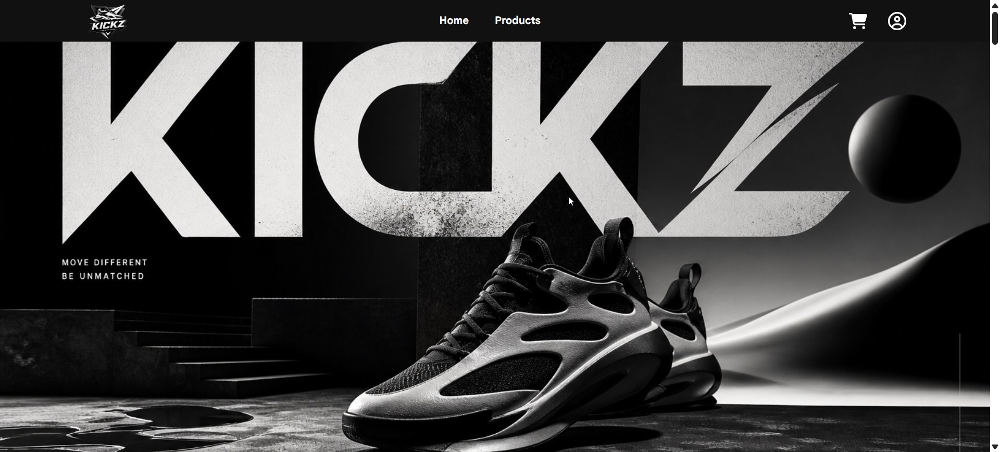
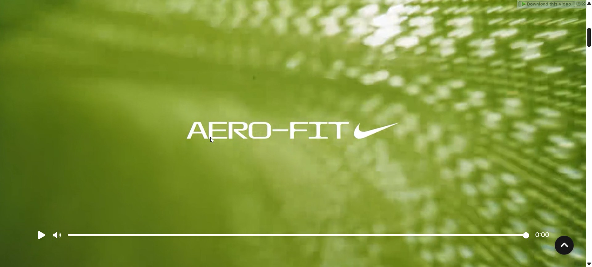
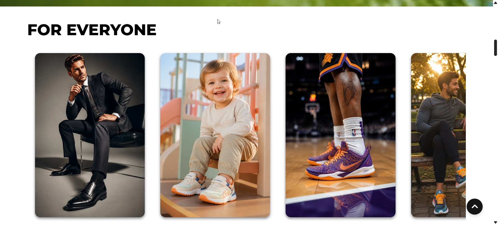
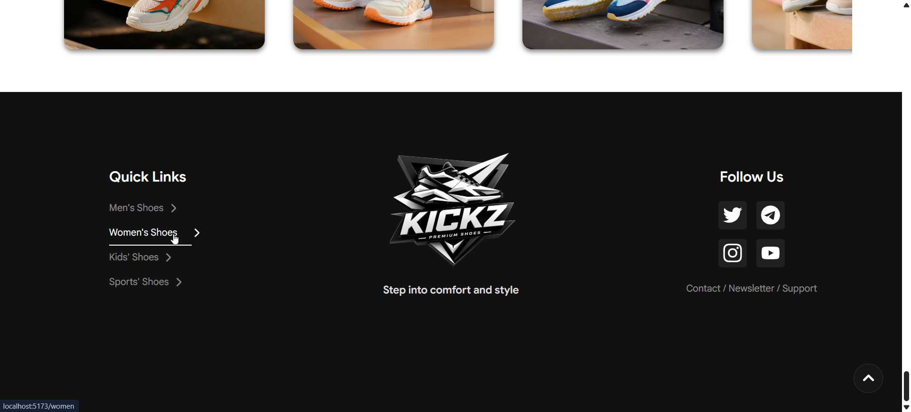
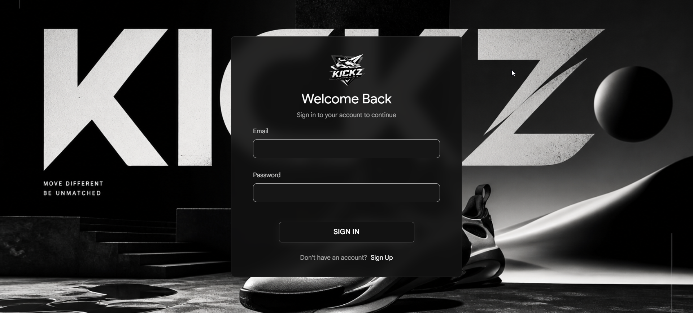
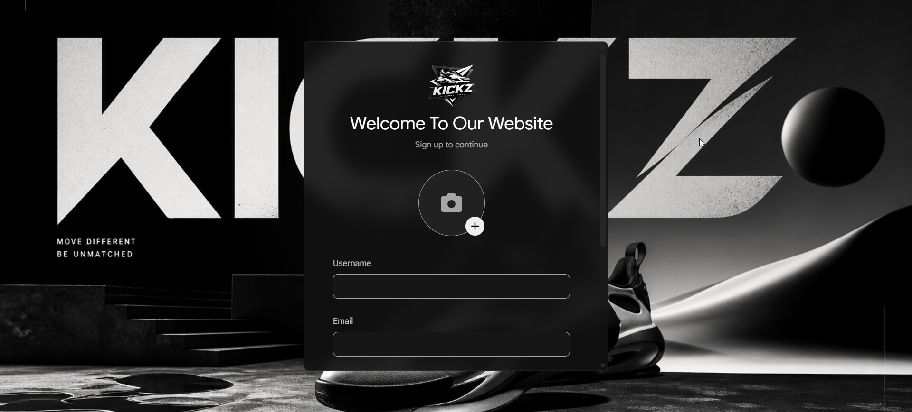
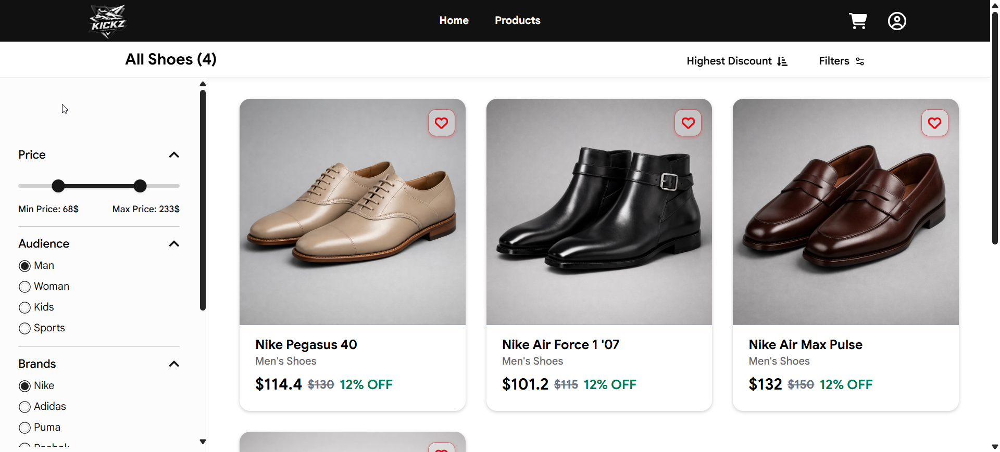
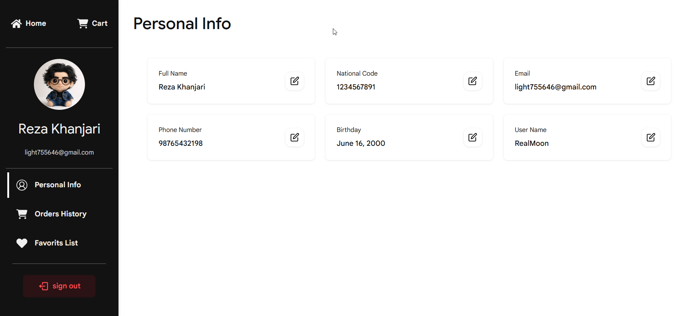
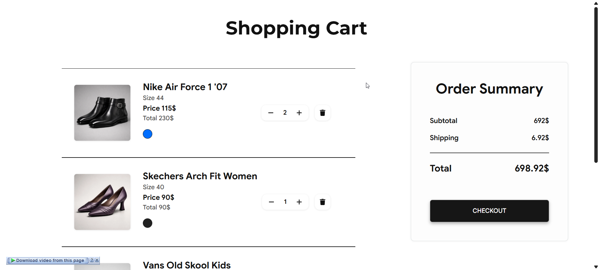
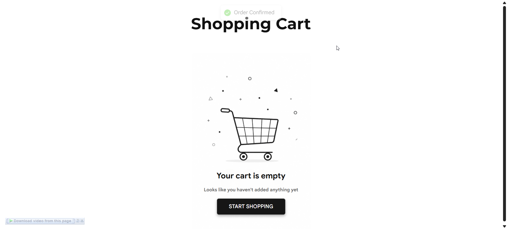

# Shoe Store

A modern, responsive shoe store web application built with **React**, **TypeScript**, and **Vite**.  
The project uses **Supabase** as the backend and combines **TanStack Query**, **Redux Toolkit**, and **React Hook Form** to deliver a scalable and maintainable frontend architecture.

## Features

- Responsive and modern UI
- Product catalog with detailed product pages
- Filtering products by:
  - brand
  - audience
  - price range
- User authentication:
  - sign up
  - log in
  - protected routes
- Favorites management
- Shopping cart with persistent state
- Order creation and order history
- User profile management
- Form validation with React Hook Form
- Server-state management with TanStack Query
- Global state management with Redux Toolkit
- Backend integration with Supabase
- Lazy-loaded routes for better performance
- Reusable UI components and layout system
- Toast notifications for user feedback

## Tech Stack

- **React 19**
- **TypeScript**
- **Vite**
- **Redux Toolkit**
- **React Redux**
- **Redux Persist**
- **TanStack React Query**
- **Supabase**
- **React Hook Form**
- **React Router**
- **Material UI**
- **Emotion**
- **Radix UI Themes**
- **Tailwind CSS**
- **React Hot Toast**
- **Day.js**
- **React Icons**

## Project Structure

```bash
src/
├── app/              # Redux store and app hooks
├── features/
│   ├── auth/         # Authentication logic, forms, protected routes
│   ├── cart/         # Cart state, cart items, summary
│   ├── favourits/    # Favorites management
│   ├── orders/       # Order creation and order list
│   ├── products/     # Product list, details, filters
│   └── profile/      # Profile and profile orders
├── hooks/            # Shared custom hooks
├── layouts/          # Header, navbar, sidebar, main layout
├── pages/            # Home, products, cart, profile, 404
├── routes/           # Route definitions
├── supabase/         # Supabase client setup
├── ui/               # Reusable UI components
└── main.tsx          # App entry point
```

---

## Architecture Overview

This project uses a combination of tools to keep the application clean and scalable:

- **Redux Toolkit** handles global client state such as the cart.
- **Redux Persist** keeps selected state across page reloads.
- **TanStack Query** manages server state, caching, and mutations.
- **React Hook Form** is used for form handling and validation.
- **Supabase** powers authentication and backend data operations.

The application root is wrapped with:

- `QueryClientProvider`
- `Provider` from React Redux
- `PersistGate`
- `Toaster`

This ensures data fetching, global state, persistence, and notifications are available across the app.

---

## Main Pages

- Home
- Products
- Product Details
- Cart
- Profile
- Login
- Signup
- Not Found

---

## 📸 Preview

### Desktop view

<p align="center">

  
    <br>
    <br>
      
      <br>
    <br>
     
      <br>
    <br>
     
    <br>
    <br>
  
    <br>
    <br>
      
      <br>
    <br>
     
    <br>
    <br>
  
    <br>
    <br>
 
  
    <br>
    <br> 
  
    <br>
    <br>

</p>
